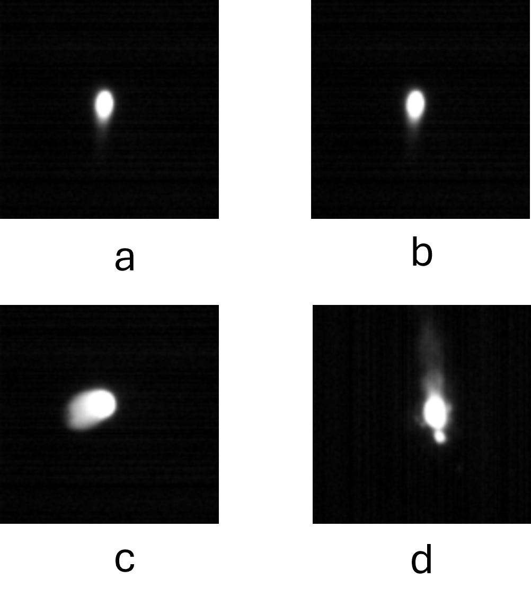
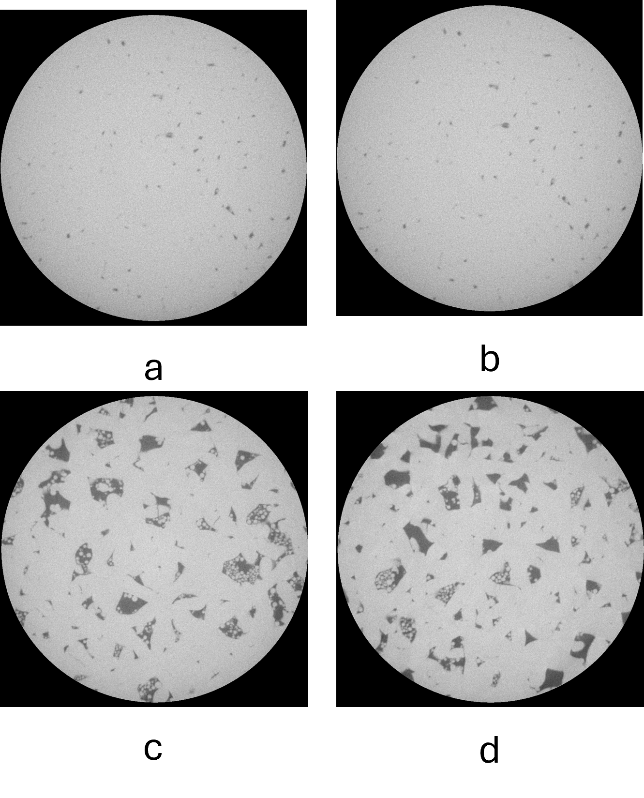

# GenAI-AM-Bench
AM dataset for evaluating GenAI models
GenAI-AM-Bench is a dataset created to evaluate Generative Artificial Intelligence (GenAI) on Additive Mnaufacturing (AM) tasks, including  melt pool image defect detection, porosity label identification, true/false queries, multiple-choice questions and free form questions.

# Dataset Overview
### 1. Melt pool imgae with Labels
- **Anomaly Detection**: Includes melt pool labeled image for identification defective and non-defective image based on features inlcuding mlt pool area and therehold....

Figure: Melt pool image with label (a) and (b) non-defective and (c) and (d) defective 

### 2. X-CT imgae with Labels
- **Porosity Label**: Includes X-CT labeled image for identification large porosity data and small porosity data.

Figure: Melt pool image with label (a) and (b) small porosity and (c) and (d) large porsity

### 2. Free-Form Questions
- **Form**: Questions are open ended qustions. 
- **Sample**: What is the differnce between AMF and STL file?
### 3. Multiple-choice questions (MCQs)
- **Form**:  Provide two choice of each question
- **Ground Truths**: Answer keys are included to assess model accuracy.
### 4. True/False Questions
- **Form**:  Provide a statement
- **Ground Truths**: Answer  should be true or false  that are included to assess model accuracy.

### 4. Prompts
- **Prompts**: Includes prompts for each type of task
